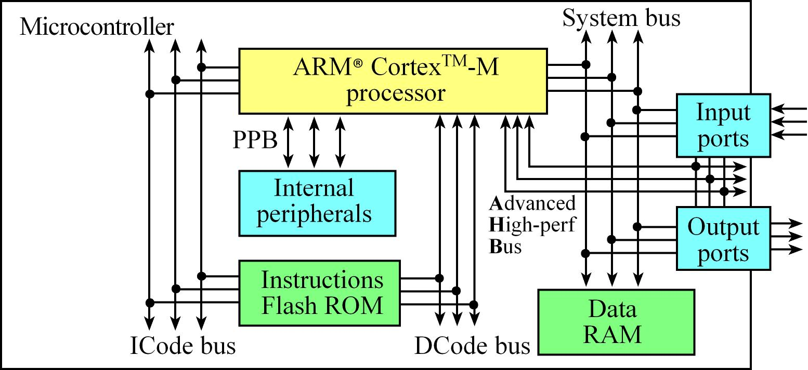
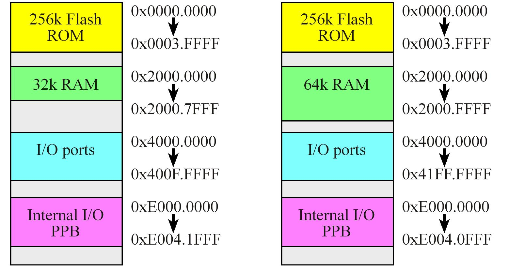

# Table Of Contents

- [Table Of Contents](#table-of-contents)
- [RTOS](#rtos)
- [Computer Architecture](#computer-architecture)
  - [Architecture Overview](#architecture-overview)
  - [Memory](#memory)
  - [Buses](#buses)
  - [Registers](#registers)
- [Stack](#stack)
- [On Reset](#on-reset)
- [I/O](#io)
- [Assembly](#assembly)
  - [Structure of an instruction](#structure-of-an-instruction)
  - [Assembler](#assembler)
  - [Addressing Modes](#addressing-modes)
  - [Instructions needed](#instructions-needed)
    - [Load and store](#load-and-store)
    - [Move data](#move-data)
    - [Arthematic](#arthematic)
    - [Interrupt Masking](#interrupt-masking)

---

# RTOS

an RTOS needs to meet a

- certain hard deadline
- with a given accuracy
- and always reliable


In the Image above, leftmost is a hardware specific simple system. Middle one contains OS which can be used for devices by multiple vendors. This can be done using HAL (Hardware Abstraction Layers) which gives pushes all the vendor specific details under the hood to make software programmer's life easy. The right most system has more cores which gives more computing power that comes with more complex concepts like synchronization, communication and assigning tasks across the cores.

> We can see that as we go from left to right, the role of OS is becoming more important.

# Computer Architecture

|  |
| --------------------------------------------------------------------------------------------------------- |
| **The above set of questions defines the architecture.**                                                  |

## Architecture Overview

Four major components of this architecture are

- BIU (Bus interface Units)
  - BIU drives the address bus drives the bus and it’s control signals, which specifies the timing, size and direction of the transfer.
  - EAR (Effective Address Register) has the memory address from the data is to be fetched from.
- CU (Control Unit)
  - CU orchestrates the sequence of the operations and commands all the other 3. components.
  - IR (Instruction Register) contains the opcode for the current instruction. For thumb-2, it maybe 16 bit or 32 bit.
- ALU (Arithmetic Logic Unit)
- Registers

A micro-controller contains all of processor, memory and I/O on a single chip.

In an embedded system, the software is converted into machine code, which is list of instructions stored in non-volatile flash ROM. These instructions are fetched and put in a pipeline. In cortex-m, the instructions are executed in-order (Means all instructions are fetched, executed and written-back in same order as compiled), however it can execute the current and fetch the next.

|  |
| ------------------------------------------------------------------------------ |
| Cortex-M architecture                                                          |

> Cortex-M has **Harvard architecture** as it has separate buses for data (System Bus) and instructions (ICode bus). It also has a DCode bus for debugging purposes.

An **interrupt** is a response by processor to an event triggered which needs an immediate attention. Components like Nested Vector Interrupt Controller (NVIC) which directly communicates with the processor via Private Peripheral Bus (PPB), helps with lower latencies of the interrupt.

## Memory

| Micro-controller | Clock Speed | Flash ROM | SRAM  |
| :--------------: | ----------- | --------- | ----- |
|     TM4C123      | 80MHz       | 256kiB    | 32kiB |
|      MSP432      | 48MHz       | 256kiB    | 64kiB |

For TM4C123 and MSP432, 32 address line are present, hence the 32 bit address space, which is divided as following.



> In general, All the beginning addresses of the regions are same, as given below, but the ending addresses depends on the specific member.
>
> - Flash ROM begins from 0x0000.0000
> - RAM from 0x2000.0000
> - I/O from 0x4000.0000
> - Private I/O from 0xE000.0000

## Buses

Having multiple buses helps processor perform multiple tasks at the same time. Some of those tasks are

- **ICode bus** - fetch opcode from ROM.
- **DCode bus** - read constant data from ROM.
- **System bus** - read/write data from RAM or I/O, fetch opcode from RAM.
- **PPB (Private Peripheral Bus)** - read/write data from internal peripherals like NVIC.
- **AHPB (Advanced High Performance Bus)** - read/write data from internal peripherals like USB.

> The items that can change over the time (The Heap,The Stack and Variables), go in the RAM and which do not (Instruction Code and Constants), go in the ROM.

## Registers


The image above depicts the registers in ARM Cortex-M processor.

- R0-15, all are of 32-bit width.
  - Registers R0 to R12 are General Purpose registers.
  - R13 is a stack pointer points to the top of the stack.
    - Actually, there are two stack pointers of which only one will be active at a time. One is MSP (Main Stack Pointer) used for OS code and the other is PSP (Process Stack Pointer) used for User Code. This seperation helps OS from crashing when user code crashes. And the Active Stack Pointer Selection (ASPSEL) = 0 - MSP and = 1 - PSP.
  - R14 is a Link pointer which contains the pointer to the return location from a subroutine call.
  - R15 is a Program counter, which points to the address of the next instruction to be fetched from the memory. So that the processor fetches the address in PC and increments it.
- PSR holds the information about flags set by the operation, like NZVC bits, Thumb bit and ISR number.
  
  - NZVCQ bits signifies the status of the previous ALU operation that signifies the result of it.
    - N = Negative
    - Z = Zero
    - V = Overflow
    - C = Carry
    - Q = Sticky Saturation
    - T = Thumb Instruction
    - ICI/IT = IF-THEN flags
- if `PRIMASK` is set to 0, the interrupts are enabled else most are not.
- `Base Priority` says the priority of the executing software. It allows only interrupts lower than this value to execute.

> The ARM Architecture Procedure Call Standard, AAPCS, part of the ARM Application Binary Interface (ABI), uses registers R0, R1, R2, and R3 to pass input parameters into a C function or an assembly subroutine. Also according to AAPCS we place the return parameter in Register R0. The standard requires functions to preserve the contents of R4-R11. In other words, functions save R4-R11, use R4-R11, and then restore R4-R11 before returning.

# Stack


Stack grows from low to high address in RAM.

> Arm Cortex-M Architecture has 32-bit `word alignment` for stack access. Which means the last 2 bits of the SP is always set to 0. To push an element, we should the decrement the SP by 4 and store the data there. likewise for pop.

As discussed above, there are two Stack Pointers's - Main Stack Pointer (MSP) used by OS code and Processor Stack Pointer (PSP) used by user software.

# On Reset

On reset,

- SP defaults to 0 and ASPSEL to 0 i.e. defaults to MSP.
- PC set to location 4, which is called reset vector.
- Link Pointer (LP) set to 0xffff_ffff, which means invalid value.
- T bit set to 1, which means it defaults to Thumb instruction mode, not ARM mode.
- Thread Previlege Level (TPL) defaults to previleged, so it'll have access to everything.

> ARM processor has two modes - Thread mode and Handler mode.
>
> Thread mode signifies that the processor is executing the main program. ISR_NUMBER is set to 0 here.
>
> Handler mode indicates that the processor is executing an ISR. All the context is saved before ISR starts. ISR uses MSP. ISR_NUMBER is set to the corresponding ISR number being served.

# I/O

A `Pin` is an Individual wire used as input/output/power/debugging.
A collection of `Pins` is called a `Port`.

There are 4 types of I/O:

- UART (Universal Asynchronous Receive Transmit)
  - Provides High speed, asynchronous and simultaneous/Duplex communication.
  - can be used for communication between two computers.
- SSI (Synchronous Serial Interface) / SPI (Serial Peripheral Interface)
  - Medium speed, Synchronous Interface
  - used to drive graphic display.
- I2C (Inter-Integrated Circuit)
  - Slow speed.
  - used to drive Temperature and light sensor.
- PWM (Pulse Width Modulation)
  - To apply variable power on motor devices.
- JTAG
  - To program and debug the microcontroller board.

# Assembly

## Structure of an instruction

`Label Opcode Operands ; Comment`

For example;

```assembly
LDR R0, =count; read count variable address into R0.
LDR R1, [R0];   read value in address R0 is holding into R1.
ADD R1, #1;     increment R1 by 1.
STR R1, [R0];   store value in R1 into the address R0 is holding.
```

## Assembler

`Assembler` converts the `assembly source code` into `object code`, which has machine level instructions to be executed by the processor. All the instructions in object are half word aligned.

The `listing` is a text file containing the mixture of object code and it's source code. When we `build`, all the file are compiled/assembled, but the addresses will remain relative. When the entire project is built, the addresses will be absolute. This can be flashed onto the ROM.

In general, the assembler creates a symbol table having entries of all the addresses of labels.

## Addressing Modes

| Mode                 | Another Name                  | Example                                                                                                                     |
| -------------------- | ----------------------------- | --------------------------------------------------------------------------------------------------------------------------- |
| Register to Register | Register Direct               | `MOV R1, R0; copy value from R0 to R1`                                                                                      |
| Immediate            | Literal                       | `MOV R1, #1; constant value is loaded`                                                                                      |
| Absolute             | Memory Direct                 | `LDR R1, 0x12345; fetch value from address`                                                                                 |
| Indexed              | Register Indirect             | `LDR R1, [R0]; fetch value from address in the register`                                                                    |
| Indexed with offset  | Register Indirect with offset | `LDR R1,[R0,#4]; fetch value from address in the register + 4`                                                              |
| PC relative          |                               | `BL Incr`                                                                                                                   |
| Register List        |                               | `PUSH {R4-R11}; Pushes register from R4 to R11 onto stack where R4 comes up in the top and R11 in the bottom of the stack.` |

## Instructions needed

### Load and store

```assembly
LDR Rd, [Rn]     ; load 32-bit memory at [Rn] to Rd
STR Rt, [Rn]     ; store Rt to 32-bit memory at [Rn]
LDR Rd, [Rn, #n] ; load 32-bit memory at [Rn+n] to Rd
STR Rt, [Rn, #n] ; store Rt to 32-bit memory at [Rn+n]
```

### Move data

```assembly
MOV   Rd, Rn         ;Move data from Rn to Rd
MOV   Rd, #imm12     ;Set Rd to the constant M
```

### Arthematic

```assembly
ADD   Rd, Rn, Rm     ;Set Rd equal to Rn + Rm
ADD   Rd, Rn, #imm12 ;Set Rd equal to Rn + M
SUB   Rd, Rn, Rm     ;Set Rd equal to Rn - Rm
SUB   Rd, Rn, #imm12 ;Set Rd equal to Rn - M
```

### Interrupt Masking

The following two instructions will affect bit 0 of the PRIMASK register. When I=0, interrupts are postponed; when I=1, interrupts are allowed.

```assembly
CPSID I              ;disable interrupts, I=1
CPSIE I              ;enable interrupts, I=0
```
